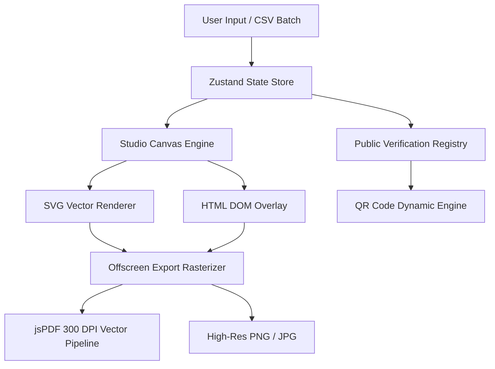

# CMAKER Architecture Overview

CMAKER is built as an enterprise-grade client-side Single Page Application (SPA) utilizing React 19, TypeScript, and modern browser APIs.

## Coordinate Space & Paper Standardization
- **Base Coordinate Plane**: 1123 × 794 virtual pixels (mapped to standard 297 × 210 mm A4 Landscape).
- **Aspect Ratio Locking**: Dynamic zoom matrix scales smoothly between 25% and 200% without subpixel jitter.
- **Layer Stacking**: Strict z-index hierarchy preserving background borders, watermark crests, text layers, vector seals, and signatures.

## High-DPI Export Pipeline
Exporting high-fidelity certificates requires overcoming standard 72/96 DPI screen limitations. CMAKER scales canvas elements by a factor of 3.125× (targeting 300 DPI physical print resolution) before serializing to jsPDF with millimeter mapping.
