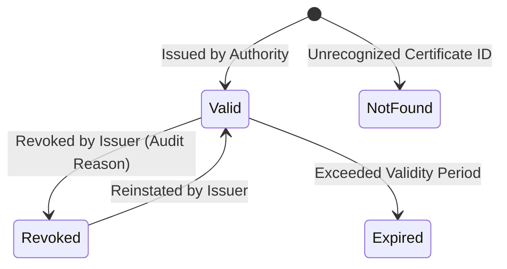

# Credential Verification Specification

## Certificate Identifier Format
All CMAKER certificates carry an immutable identifier formatted as:
```
CERT-YYYYMMDD-[4-HEX-OR-NUM]
Example: CERT-20260905-7281
```

## Verification Lifecycle


## Status Codes
- `VALID`: Certificate is genuine, registered, and active.
- `REVOKED`: Certificate was invalidated due to academic dishonesty, credential recall, or data correction.
- `EXPIRED`: Certificate was authentic but has passed its validity window.
- `NOT_FOUND`: Identifier does not exist in the issuer registry.
